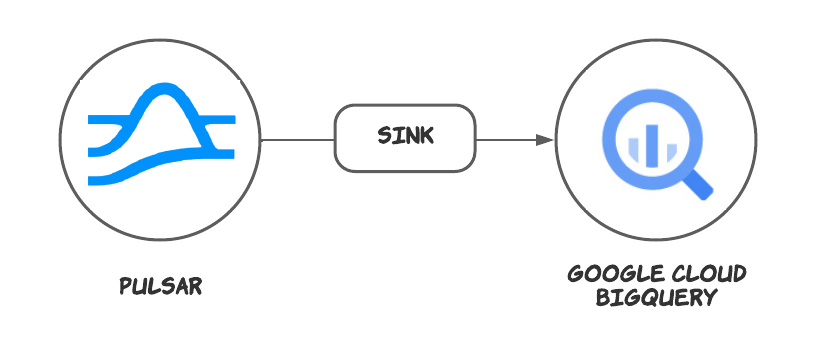

## Google BigQuery sink connector

The [Google BigQuery](https://cloud.google.com/bigquery) connector is a [Pulsar IO connector](http://pulsar.apache.org/docs/en/next/io-overview/) for copying data between Google BigQuery and Pulsar. 

This connector pulls data from Pulsar topics and persists data to Google BigQuery.



Currently, Google BigQuery connector versions (`x.y.z`) are based on Pulsar versions (`x.y.z`).

| Google BigQuery connector version                                                   | Pulsar version                                 | Doc                                                                                                     |
|:------------------------------------------------------------------------------------|:-----------------------------------------------|:--------------------------------------------------------------------------------------------------------|
| [2.8.x](https://github.com/streamnative/pulsar-io-bigquery/releases/tag/v2.8.3.5)   | [2.8.0](http://pulsar.apache.org/en/download/) | [Google BigQuery sink connector doc](https://hub.streamnative.io/connectors/google-bigquery/v2.8.3.5/)  |
| [2.9.x](https://github.com/streamnative/pulsar-io-bigquery/releases/tag/v2.9.2.11)  | [2.9.0](http://pulsar.apache.org/en/download/) | [Google BigQuery sink connector doc](https://hub.streamnative.io/connectors/google-bigquery/v2.9.2.11/) |
| [2.10.x](https://github.com/streamnative/pulsar-io-bigquery/releases/tag/v2.10.0.7) | [2.9.0](http://pulsar.apache.org/en/download/) | [Google BigQuery sink connector doc](https://hub.streamnative.io/connectors/google-bigquery/v2.10.0.7/) |


## Project layout

Below are the sub folders and files of this project and their corresponding descriptions.

```bash
├── conf // examples of configuration files of this connector
├── docs // user guides of this connector
├── script // scripts of this connector
├── src // source code of this connector
│   ├── checkstyle // checkstyle configuration files of this connector
│   ├── license // license header for this project. `mvn license:format` can
    be used for formatting the project with the stored license header in this directory
│   │   └── ALv2
│   ├── main // main source files of this connector
│   │   └── java
│   ├── spotbugs // spotbugs configuration files of this connector
│   └── test // test related files of this connector
│       └── java
```

## License

Licensed under the Apache License Version 2.0: http://www.apache.org/licenses/LICENSE-2.0